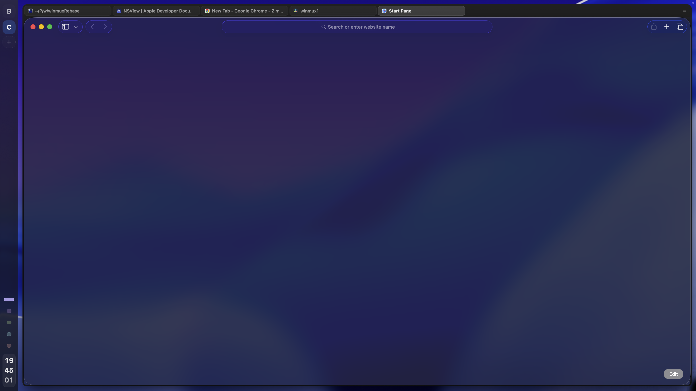

<p align="left">
  
</p>

# WinMux

This is a fork of [ZimengXiong/winmux](https://github.com/ZimengXiong/winmux), used for experimenting with sidebar workflow improvements.

<p align="left">A powerful sidebar-first window manager for macOS.</p>

https://github.com/user-attachments/assets/51983568-a168-494f-8ae3-5f50ca1efce1

## Highlights
### Tabs
Tabs are the top-level working views in WinMux. A tab can hold one window or a composed split layout with multiple windows.

### Sidebar
The sidebar is a more interactively-performant and useful alternative to [Sketchybar](https://github.com/felixkratz/sketchybar) and traditional tab menu bar dropdowns for most everyday tasks. It provides better visibility into spaces and spatial awareness on the desktop.

You can drag windows in and out of the sidebar from and to the current tab. You can rearrange windows across all tabs using the sidebar, including folders.

The sidebar can be configured (as shown) to display the current date and time.


### Folders

Folders let you group related sidebar tabs together without merging their composed window layouts. This is useful when you want a tidy set of reference tabs, several browser-profile tabs, or a batch of fullscreen views that should stay near each other.

Folders can be expanded or hidden from the sidebar, and WinMux remembers that state. Drag one tab onto another to create a folder, drag tabs within a folder to reorder them, or drag a tab back into the active view to compose it with the current tab.

### Philosophy

#### Empty Tabs
You can not keep tabs that have no windows in them. Empty tabs are automatically removed.

### Multi-Monitors
Each monitor has its own sidebar tab list. Monitors can be treated as *independent* from each other while still sharing the same app state.

Monitors can not show the same tab at the same time.

#### App Launching
WinMux supports single-modifer keybindings (e.g. triggering an action on press of `⌘`)

I highly recommend that you configure the apps you use every day to be launch with Left/Right Option+Command, or similar shortcuts, otherwise it might be hard to launch common things into the current tab (and instead, take you to the other tab where the app is currently active). Here is some of the apps that I have keybinded:

```toml
[mode.main.binding-tap]
    left-alt = 'exec-and-forget /Applications/Google\ Chrome.app/Contents/MacOS/Google\ Chrome --profile-directory="Default"'
    right-cmd = 'exec-and-forget /Applications/Google\ Chrome.app/Contents/MacOS/Google\ Chrome --profile-directory="Profile 1"'

[mode.main.binding]
    # Disable the native "Hide App" shortcut.
    cmd-h = []

    cmd-d = 'exec-and-forget osascript ~/Documents/scripts/launchTerminalWindow.scpt'
    cmd-e = 'exec-and-forget osascript ~/Documents/scripts/launchFinderWindow.scpt'
```

```applescript
# ~/Documents/scripts/launchTerminalWindow.scpt
tell application "cmux"
    if it is running
        tell application "System Events" to tell process "cmux"
            click menu item "New Window" of menu "File" of menu bar 1
        end tell
    else
        activate
    end if
end tell

# ~/Documents/scripts/launchFinderWindow.scpt
tell application "Finder"
    if it is running
        tell application "System Events" to tell process "Finder"
            click menu item "New Finder Window" of menu "File" of menu bar 1
        end tell
    else
        activate
    end if
end tell

```

## Installation
Download the latest binary from releases and launch.

As WinMux is not signed, you will need to bypass gatekeeper:

```bash
xattr -dr com.apple.quarantine /Applications/WinMux.app/
```

## Development
Build and run this fork locally:

```bash
make build VERSION=0.2.1
./.debug/WinMuxApp --config-path ~/.config/winmux/winmux.toml
```

This branch includes sidebar refinements:

- Each window row has a bare `x` close control, without a circular background, for closing exactly that window.
- Closing a window from the sidebar refreshes the sidebar model afterward.
- The sidebar keeps a minimum 12pt top padding even when outer window gaps are set to `0`.

## Migrating
### From AeroSpace
If `~/.config/winmux/winmux.toml` already exists, WinMux uses it as-is.

If you have an AeroSpace config but no WinMux config yet, WinMux creates one for you on first launch. It copies over your AeroSpace shortcuts/key mapping and fills in the rest with WinMux defaults, including the sidebar, Tabs, and Folders.

You do not need to edit anything to get started. After import, WinMux uses `~/.config/winmux/winmux.toml` and leaves your AeroSpace config alone.

If neither exists, WinMux creates a new WinMux config with the bundled defaults.

## Credits
[Aerospace](https://github.com/nikitabobko/AeroSpace)
